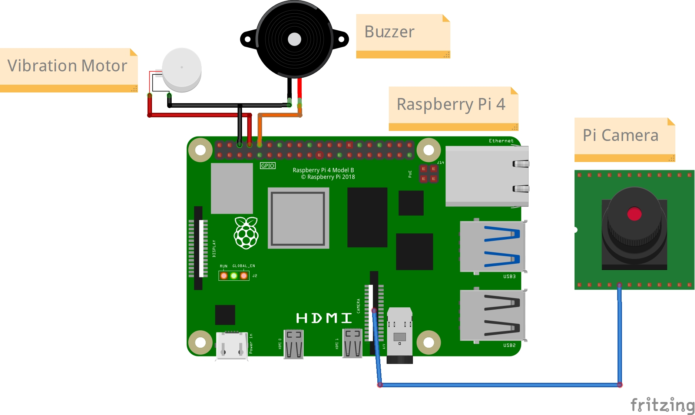
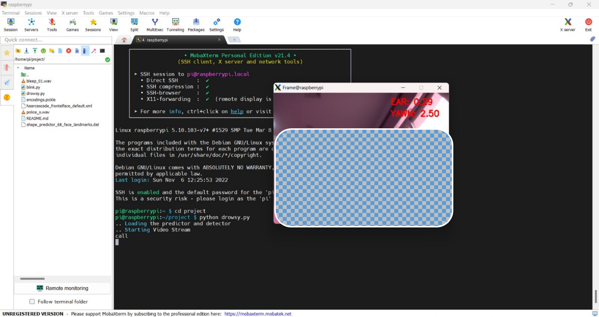

<div align="center">

# 😴 Drowsy Driver Detector

**Real-time drowsiness & yawn detection with vibration + audible alerts, built on a Raspberry Pi.**

[](https://www.python.org/)
[](https://opencv.org/)
[](http://dlib.net/)
[](https://www.raspberrypi.org/)
[](LICENSE)
[](https://github.com/eahmeddarwish/drowsy-driver-detector)

</div>

---

## 🌍 Overview | نظرة عامة

**[English]** Drowsy Driver Detector watches the driver's face through a camera and estimates two things in real time: how closed the eyes are (Eye Aspect Ratio) and how open the mouth is (yawn distance). When either crosses a threshold for several consecutive frames — not a single flicker — it triggers a vibration motor, a buzzer, and a spoken warning. Originally built as a Computer Engineering graduation project (Raspberry Pi + night-vision camera), it also runs on any laptop webcam with no hardware attached, for development, demos, or a software-only deployment path.

**[العربية]** نظام "متتبع نعاس السائق" بيراقب وش السائق عبر كاميرا، ويحسب في الوقت الفعلي حاجتين: مدى انغلاق العين (Eye Aspect Ratio) ومدى فتح الفم (مؤشر التثاؤب). لما أي مؤشر يتخطى الحد المسموح لعدد إطارات متتالية — مش لمحة عابرة واحدة — بيشغّل موتور اهتزاز وبازر وتنبيه صوتي. المشروع بدأ كمشروع تخرج هندسة حاسوب (Raspberry Pi + كاميرا ليلية)، وبيشتغل كمان على أي كاميرا لابتوب من غير أي هاردوير، للتطوير والعروض التقديمية أو كنسخة برمجية بحتة.

> ⚠️ **Safety notice | تنبيه أمان:** This is a driver-assistance aid, not a certified safety device — it does not replace attentive, rested driving. / النظام أداة مساعدة للتنبيه، مش جهاز سلامة معتمد، وما يغنيش عن قيادة يقظة ومرتاحة.

---

## ✨ Key Features | المميزات

| Feature | الميزة |
|---|---|
| Eye Aspect Ratio (EAR) drowsiness detection | كشف النعاس عبر نسبة انغلاق العين |
| Yawn detection via mouth-opening distance | كشف التثاؤب عبر مسافة فتح الفم |
| Debounced alerts (N consecutive frames, not 1 blink) | تنبيهات مُثبّتة (عدد إطارات متتالي، مش رمشة واحدة) |
| Vibration motor + buzzer + spoken TTS warning | موتور اهتزاز + بازر + تحذير صوتي |
| Works with Pi Camera **or** any USB/laptop webcam | يشتغل بكاميرا الـ Pi **أو** أي ويب كام USB/لابتوب |
| Fully configurable thresholds (env vars, no code edits) | حدود قابلة للتعديل بالكامل (متغيرات بيئة، بدون تعديل كود) |
| No video is ever recorded or stored | لا يتم تسجيل أو حفظ أي فيديو إطلاقاً |
| Runs headless (no monitor) for in-vehicle deployment | يشتغل بدون شاشة للتركيب داخل السيارة |

---

## 🏗️ Architecture | معمارية المشروع

```
drowsy-driver-detector/
├── app/
│   ├── config.py     # All thresholds & pins — env-overridable
│   ├── detector.py   # EAR + yawn math (pure functions, unit-testable)
│   ├── camera.py     # PiCamera / webcam source abstraction
│   ├── alerts.py     # GPIO + TTS alert manager (daemon-fixed, cooldown-limited)
│   └── main.py        # Video loop, wires everything together
├── models/            # Downloaded via scripts/download_models.sh (not in git)
├── scripts/           # Model download + system dependency install helpers
├── systemd/            # Boot-time auto-start unit for a dedicated Pi install
└── assets/hardware/    # Circuit diagram, breadboard photo, Fritzing sketch
```

| Module | Role | الدور |
|---|---|---|
| `detector.py` | EAR & yawn-distance math from 68 facial landmarks | حسابات EAR ومسافة التثاؤب |
| `camera.py` | Starts PiCamera or a webcam by index | تشغيل كاميرا الـ Pi أو ويب كام |
| `alerts.py` | Drives GPIO + spoken alerts, debounced & rate-limited | التحكم بالـ GPIO والتنبيه الصوتي |
| `main.py` | Captures frames, runs detection, renders overlay | حلقة الفيديو الرئيسية |

---

## 🚀 Quick Start | البداية السريعة

### Option A — Raspberry Pi (hardware mode)

```bash
git clone https://github.com/eahmeddarwish/drowsy-driver-detector.git
cd drowsy-driver-detector

bash scripts/install-system-deps.sh      # build tools, espeak
pip install -r requirements.txt
pip install RPi.GPIO picamera            # Pi-only packages

bash scripts/download_models.sh          # fetches the 68-point landmark model

python3 -m app.main                      # CAMERA_SOURCE=picamera by default
```

### Option B — Any laptop (desktop / dev / demo mode, no hardware needed)

```bash
git clone https://github.com/eahmeddarwish/drowsy-driver-detector.git
cd drowsy-driver-detector

pip install -r requirements.txt
bash scripts/download_models.sh          # or manually, see script for the URL

python3 -m app.main --camera webcam
```

On a non-Pi machine, GPIO output and speech are automatically logged instead of driven — the detection window and on-screen `DROWSINESS ALERT!` / `YAWN ALERT!` overlays still work normally.

### Option C — Headless (in-vehicle, no monitor)

```bash
python3 -m app.main --no-display
```

Press **q** in the video window to quit (Options A/B).

---

## ⚙️ Configuration | الإعدادات

Copy `.env.example` to `.env` and adjust — no code changes needed to calibrate for a specific camera angle or driver:

| Variable | Default | Meaning |
|---|---|---|
| `CAMERA_SOURCE` | `picamera` | `picamera` or `webcam` |
| `WEBCAM_INDEX` | `0` | Which USB camera to use |
| `EYE_AR_THRESH` | `0.25` | EAR below this = eyes considered closed |
| `EYE_AR_CONSEC_FRAMES` | `15` | Consecutive closed-eye frames before alarm fires |
| `YAWN_THRESH` | `20.0` | Mouth-opening distance (px) above this = yawn |
| `YAWN_CONSEC_FRAMES` | `10` | Consecutive yawn frames before alarm fires |
| `GPIO_VIBRATION_PIN` / `GPIO_BUZZER_PIN` | `8` / `10` | BOARD-numbered GPIO pins |
| `ALERT_COOLDOWN_SECONDS` | `3.0` | Gap between repeated spoken warnings |

---

## 🔧 Hardware Used | الهاردوير المستخدم

| Component | المكوّن |
|---|---|
| Raspberry Pi (any model with GPIO + camera port) | Raspberry Pi (أي موديل فيه GPIO ومنفذ كاميرا) |
| 5MP night-vision-enabled Pi Camera | كاميرا Pi ليلية 5 ميجابكسل |
| Vibration motor | موتور اهتزاز |
| Buzzer | بازر |

<div align="center">
  
  
</div>

Wiring reference (Fritzing source): `assets/hardware/circuit.fzz`

---

## 🔒 Security & Privacy Notes | ملاحظات الأمان والخصوصية

- **[EN]** All video processing happens locally and in memory — no frame is ever written to disk, uploaded, or logged. No secrets (Wi-Fi credentials, API keys) are stored in this repository; `wpa_supplicant.conf` and `.env` are git-ignored.
- **[AR]** كل معالجة الفيديو بتتم محلياً في الذاكرة فقط — ولا يتم حفظ أو رفع أو تسجيل أي إطار فيديو. مفيش أي أسرار (بيانات واي فاي، مفاتيح API) مخزّنة في المستودع؛ ملفات `wpa_supplicant.conf` و`.env` مستبعدة عبر `.gitignore`.

---

## 🗺️ Roadmap | خارطة الطريق

Earlier prototyping by the project team explored driver-identity verification (face recognition against a known-driver profile) and push/SMS notifications to a third party on a drowsiness event. Both are natural v2 directions for a commercial deployment and are intentionally **not** included here yet (they require handling biometric data and third-party credentials responsibly — outside the scope of this public release):

- [ ] Optional driver-identity check before arming alerts
- [ ] Configurable push/SMS notification on repeated drowsiness events
- [ ] Per-driver threshold auto-calibration (glasses, eye shape, seating position)
- [ ] Logging of alert *events* only (timestamp/type, never video) for fleet use

---

## 🎓 Academic Origin | الأصل الأكاديمي

Originally developed as a Computer Engineering graduation project ("**Anti-Sleep Alarm for Drowsy Drivers**") at the **American University of the Middle East (AUM)**, Kuwait, under faculty supervision. This repository is a cleaned-up, hardened, and modularized version of that work, prepared for public/academic reuse and as a foundation for a possible commercial iteration.

---

## 👤 Author | المطوّر

<div align="center">

**Ahmed Darwish**

[](https://github.com/eahmeddarwish)
[](https://huggingface.co/engdarwish)
[](https://engdarwish.com)

</div>

## 📄 License

MIT — see [LICENSE](LICENSE).

---

<div align="center">

⭐ If this project is useful, consider starring the repo!

</div>
